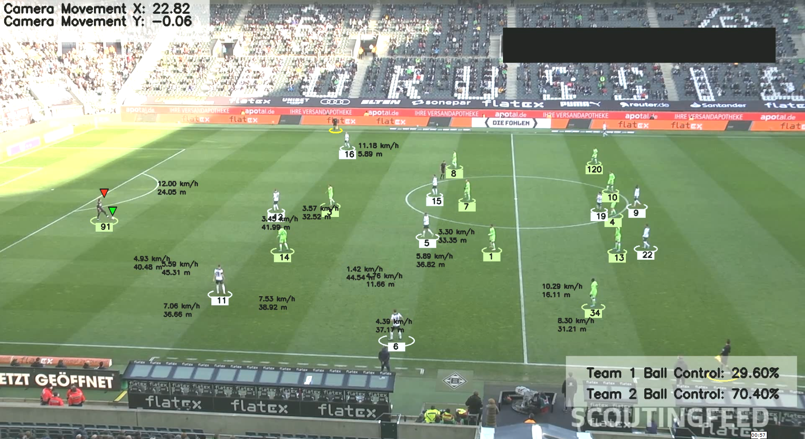

# ⚽ Football Player Detection & Tracking with YOLO

This project leverages YOLO object detection and computer vision techniques to detect and track football players, referees, and the ball in match footage. It calculates player speed and distance using camera motion and perspective transformation, and distinguishes teams using color-based clustering.

---
## 🖼️ Output Preview




## 🔧 Key Features

- Detect players, referees, and ball using YOLOv5/v8 (Ultralytics).
- Train and resume training on custom football datasets via Google Colab.
- Track objects across video frames using ByteTrack (Supervision).
- Assign players to teams based on jersey color (KMeans).
- Estimate camera motion using Optical Flow.
- Use Perspective Transformation to measure real-world distances.
- Calculate player speed and distance covered.

---

## 🧠 Tech Stack

- `ultralytics` (YOLOv5/YOLOv8)
- `opencv-python` (video processing, optical flow)
- `scikit-learn` (KMeans clustering)
- `supervision` (ByteTrack tracking)
- `pickle`, `os`, `Colab`, `Google Drive` for model persistence

---

## 📁 Folder Structure

.
├── input_videos/ # Input match videos (.avi/.mp4) — excluded from repo
├── output_videos/ # Output processed videos
├── utils.py # Read and save video functions
├── main.py # Runs detection & tracking pipeline
├── trackers.py # YOLO + ByteTrack tracker class
├── .gitignore # Ignores video files and other large folders

yaml
Copy
Edit

---

## 🎓 How to Train / Resume Training on Colab

1. **Initial Training** (saves every epoch):

```bash
!python train.py --img 640 --batch 16 --epochs 100 --data "/content/football-players-detection-1/data.yaml" \
  --weights "yolov5s.pt" --project "/content/drive/MyDrive/Football_YOLO_Checkpoints" \
  --name "football_yolo_training" --save-period 1
Resume Training from last checkpoint:

bash
Copy
Edit
--weights "/content/drive/MyDrive/Football_YOLO_Checkpoints/football_yolo_training/weights/last.pt"
📦 Datasets & Sources
🎥 YouTube Video Source

📊 Kaggle Football Dataset

📁 Google Drive Match Video

🤖 Roboflow Dataset

📝 Notes
.avi, .mp4, and other large video files are excluded via .gitignore.

Checkpoints and training artifacts are saved to Google Drive.

Designed for scalability and reproducibility in Google Colab.

📽️ Demo Notebook
Open in Google Colab

🙌 Credits
YOLOv5/YOLOv8 by Ultralytics

Tracking via Supervision Library

vbnet
Copy
Edit

---

### ✅ Key Improvements:

- **Removed raw code blocks** that don't belong in a README (main.py, Tracker class).
- Kept training info short, practical, and ready to copy-paste.
- Structured content into meaningful sections.
- Focused on **what** the project does, not just **how** it works.

Let me know if you'd like:
- A README badge section (Python version, stars, license, etc.)
- A section on how to run the code locally
- GIF preview of the tracking in action

Happy to help you polish it even more.


You said:
i want license and credit to Abdullah Tarek 


ChatGPT said:
Great! Here’s the updated README.md summary with a License section and credit to Abdullah Tarek.

markdown
Copy
Edit
# ⚽ Football Player Detection & Tracking with YOLO

This project leverages YOLO object detection and computer vision techniques to detect and track football players, referees, and the ball in match footage. It calculates player speed and distance using camera motion and perspective transformation, and distinguishes teams using color-based clustering.

---

## 🔧 Key Features

- Detect players, referees, and ball using YOLOv5/v8 (Ultralytics).
- Train and resume training on custom football datasets via Google Colab.
- Track objects across video frames using ByteTrack (Supervision).
- Assign players to teams based on jersey color (KMeans).
- Estimate camera motion using Optical Flow.
- Use Perspective Transformation to measure real-world distances.
- Calculate player speed and distance covered.

---

## 🧠 Tech Stack

- `ultralytics` (YOLOv5/YOLOv8)
- `opencv-python` (video processing, optical flow)
- `scikit-learn` (KMeans clustering)
- `supervision` (ByteTrack tracking)
- `pickle`, `os`, `Colab`, `Google Drive` for model persistence

---

## 📁 Folder Structure

.
├── input_videos/ # Input match videos (.avi/.mp4) — excluded from repo
├── output_videos/ # Output processed videos
├── utils.py # Read and save video functions
├── main.py # Runs detection & tracking pipeline
├── trackers.py # YOLO + ByteTrack tracker class
├── .gitignore # Ignores video files and other large folders

yaml
Copy
Edit

---

## 🎓 How to Train / Resume Training on Colab

1. **Initial Training** (saves every epoch):

```bash
!python train.py --img 640 --batch 16 --epochs 100 --data "/content/football-players-detection-1/data.yaml" \
  --weights "yolov5s.pt" --project "/content/drive/MyDrive/Football_YOLO_Checkpoints" \
  --name "football_yolo_training" --save-period 1
Resume Training from last checkpoint:

bash
Copy
Edit
--weights "/content/drive/MyDrive/Football_YOLO_Checkpoints/football_yolo_training/weights/last.pt"
📦 Datasets & Sources
🎥 YouTube Video Source

📊 Kaggle Football Dataset

📁 Google Drive Match Video

🤖 Roboflow Dataset

📽️ Demo Notebook
Open in Google Colab

## Credits

- Inspired and partially based on work by [Abdullah Tarek](https://github.com/Abdallah-Tarek)

## License

This project is licensed under the MIT License - see the [LICENSE](LICENSE) file for details.